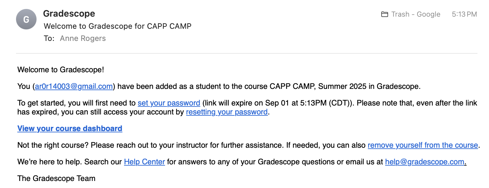
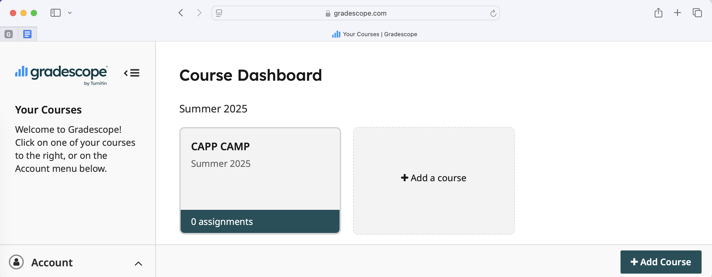
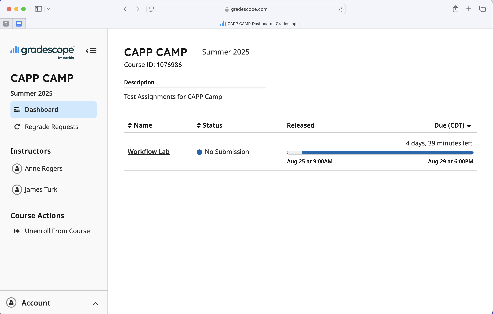
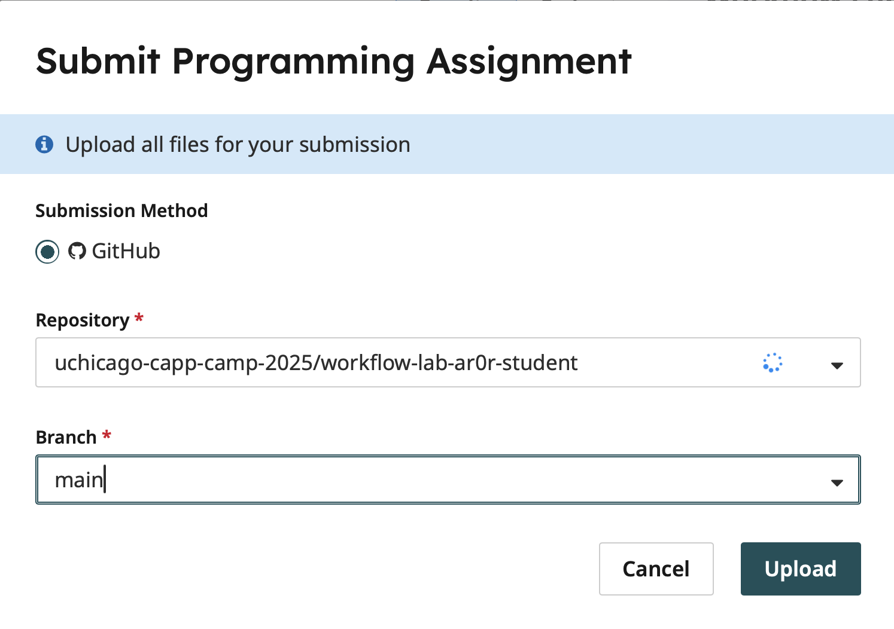
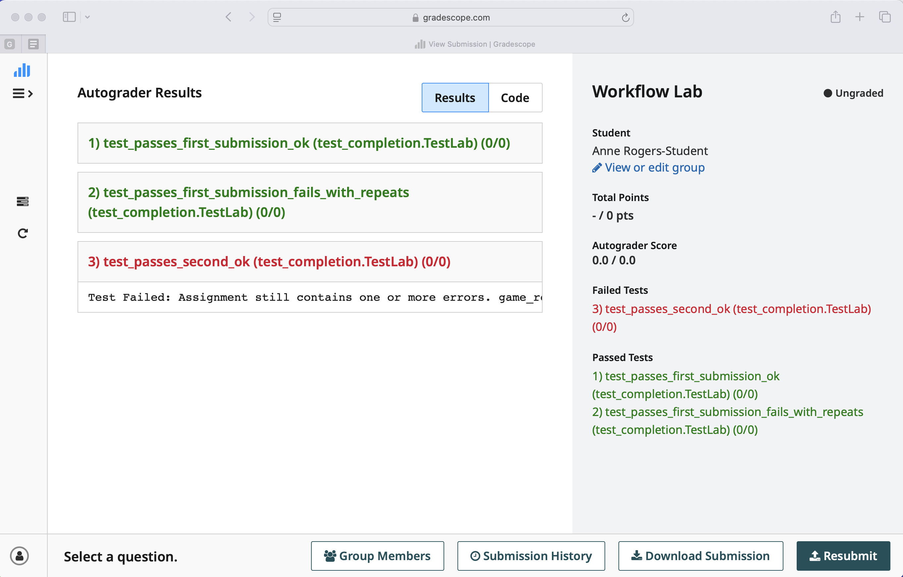
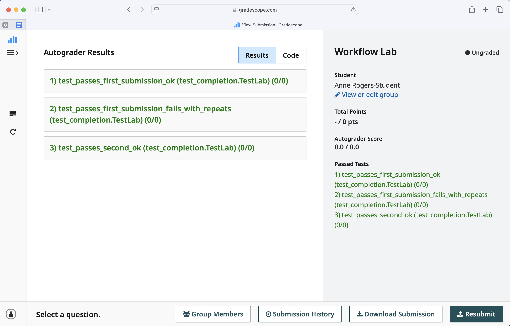

# CAPP Camp Python Workflow Lab

The goal of this lab is to help you become more comfortable with working with Python, and the workflow introduced today.

Since you are not expected to know how to write Python at this point this process may feel intimidating, but for this lab focus on what we've covered and feel free to discuss with peers.

In this lab you will be trying to get a program running by correcting some errors.

## Tips

- The focus of this lab is on the workflow we discussed: run the code, see an error, diagnose & fix, repeat.
- Remember, the '#' character is a comment. You'll notice VSCode colors everything after that on a line differently. Code following a '#' is not run.
- Try to do this without relying too much on external resources or tools, you, of course, can and will use those in the future, but for today- practice with what is in front of you.
- Don't let the fact that you likely do not understand the code yet get in your way, focus on the error messages you receive and they'll guide you to working code.
- Feel free to experiment and make changes to the code to better understand it! You can always use `git diff` and `git restore` to undo those changes as needed.

## The Game

Our end goal is to have Python script that implements a game in which
a word is chosen randomly from a list and players have six tries to
guess the word-- guessing one letter at a time.  Additionally,
repeated guesses should not be charged against the player's budget
of six tries.

The file `workflow-practice/game.py` contains a programmer's initial attempt to
implement this game.  The programmer, very sensibly, decided to
implement a simpler game to start.  Their game always uses the
same word and it charges players for guessing the same letter multiple
times.

Unfortunately, the program has a few bugs right now that you're going to
need to fix.

## Setup

Before you get started on finding the errors, you should run `uv sync`
in your ``workflow-lab`` directory to install the *dependencies*, that
is, the Python tools and libraries that you need to do this lab.

Once you have done the `uv sync`, you will want to change to the
`workflow-practice` directory and open VS Code.

## Part 1 - Syntax Errors

There are two syntax errors in the code you've been given that you'll need to fix.

To find these, try running the code via `uv run python game.py` and look at the first error you get:

```
$ uv run python game.py
  File "/home/jturk/capp-camp-workflow-lab/game.py", line 24
    revealed = ["_", "_", "_"
               ^
SyntaxError: '[' was never closed
```

Consider what this error message is telling you, and make the appropriate fix.

Once that's done, try running the code again and you will encounter one more SyntaxError.

Continue the cycle of fixing and running the program until you no longer see a SyntaxError. (When you see a TypeError, it is time to move to the next section.)

**Reminder: Now that you've solved one part of the assignment, it is a good time to do a commit (and push) so you don't lose your work.**

For example:

```
$ git add -u
$ git commit -m "solved part 1"
$ git push origin main
```

(You can also use `git commit -am "solved part 1"` to combine `git add -u` and `git commit` into a single step.)

## Part 2 - Type Error

After fixing the two typos, you will encounter a different kind of error. A TypeError indicates that you are attempting to use data in a way that is not possible for that data's type.

For example, there is no value Python can give for `"hello" + 123`, since this code adds variables of `str` and `int` type.
So instead, you will see a `TypeError`.

Fix the `TypeError` that arises, and you should be able to begin to play the game. Before you do, make another commit.

## Part 3 - Runtime Error

The code should now start to run, but depending on what letter you pick it may crash.
Unlike syntax errors which can be detected automatically, some errors only arise under precise conditions.

This situation occurs because we need the interpreter to reach the
code with an error to know that such an error exists. For this reason
you'll see these types of errors referred to as "runtime" errors.

Run the game via `uv run python3 game.py` as before, and try entering the letter "b" as your first guess. The game should reflect the fact that there is no "b" in the word.

Try and find a letter that crashes the program. Use the resulting error message as you did before, and fix the error.

Remember to make a commit here as well!

## Part 4 - GitHub + Gradescope

We have been encouraging you to create commits as you complete each
part.  If you have not done so, please create a commit now and sync
the code on your remote GitHub branch (`main`) with the code from your
current local branch of the same name. You can sync your local and
remote branches using: `git push origin main`, the first time, and
`git push`, subsequently.

Once you have pushed your code, navigate to your repository on GitHub
using a browser and confirm that your updates are present. View the
commits you made and the files that have changed.  If any of your
changes are missing, use `git status` to check the status of your
files in your local branch.

You will be using Gradescope to submit your work in many of your CS
courses, including CAPP 30121.  By default, Gradescope allows students
to upload their solutions as many times as they like before the
deadline.  As you work on your assignments, it is a good idea to
upload a draft solution well ahead of the deadline to make sure that
you get something in before the deadline.  If you continue to work and
make more progress, you can upload new versions as needed.  The
instructor will grade the last submission that comes in before the
deadline.

Now is a good time to practice this process.   

First, you will need to setup your Gradescope account.  Look in your email for a message from Gradescope and follow the link to set your password and immediately log into the site.



Once you set your password, you'll land on your Course Dashboard page: 



Choose CAPP CAMP and then 

 and click on the "Workflow Lab" assignment:

 

 Before you can submit your assignment, you will be asked to give Gradescope  access to your GitHub account:

  

 Follow the instructions to connect the two.

 Once you have done so, you will be able to submit.  Choose your 
 `workflow-lab-GITHUB_USERNAME` repository in the repository dropdown and `main`
 in the branch dropdown and then click Upload:



(This figure shows the repository for `ar0r-student`.  You will choose
your own.)


An auto-grader will then run. If you completed the first few parts correctly, 
your code should pass the first two tests, but fail the third one.




## Part 5 - Adding debugging Statements

Now that the programmer has the basic functionality of the game
working, they are ready to add code to choose the word-to-be-guessed
randomly and to handle repeated guesses properly.

Normally, the programmer would add merely add their code to
``game.py``, but to simplify things for you, we have created a new
script, called `game_repeats.py`, for this purpose.  For the rest of
this lab, you will be working with `game_repeats.py`

Give the new program a try: `uv run python game_repeats.py`.

One thing that you may notice: from a testing perspective, it was
awfully convenient to know the target word while you were testing!

We can provide the same convenience by adding code to print the chosen
word.  In general, adding thoughtfully designed and placed print
statements can be very useful for debugging and testing purposes.

We included a commented out version of an appropriate print statement
in line 31.  To activate it: delete the `#` and the space that follows
it, save the code, and try running it again.

Notice that the print statement includes some text that explains the
value that is being printed (`chosen word:`) in addition to the actual
word.  It is always a good idea to label any value printed for
debugging/testing purposes.


## Part 6 - Another Runtime Error

This new version has a bug lurking within.

For this one, we won't give you the exact condition right away. Experiment with different input to try and trigger it. Thoroughly testing your program is a skill in and of itself.

If you aren't having luck, consider the different things that the program is supposed to do. Track your guesses remaining, what letters have already been guessed, etc. Have you explored all of the functionality?

If you'd like a hint take a look at hint6.md.

Once resolved, be sure to commit!

## Part 7 - Remove your debugging statement

Now that the program is working, it is time to remove any code you
added for debugging purposes.  Specifically, you will want to remove
the print statement in Line 31!

Once you have done so.  Try your program again to make sure that your
changes did not break the program and then create a commit.


## Submitting Your Assignment

Once your assignment is complete, be sure you have committed all changes and pushed your code to your GitHub Classroom repository and then
go to the "Workflow Lab" assignment on Gradescope and resubmit your repository.

If you completed the assignment correctly, your code should pass the autograder without any errors.


